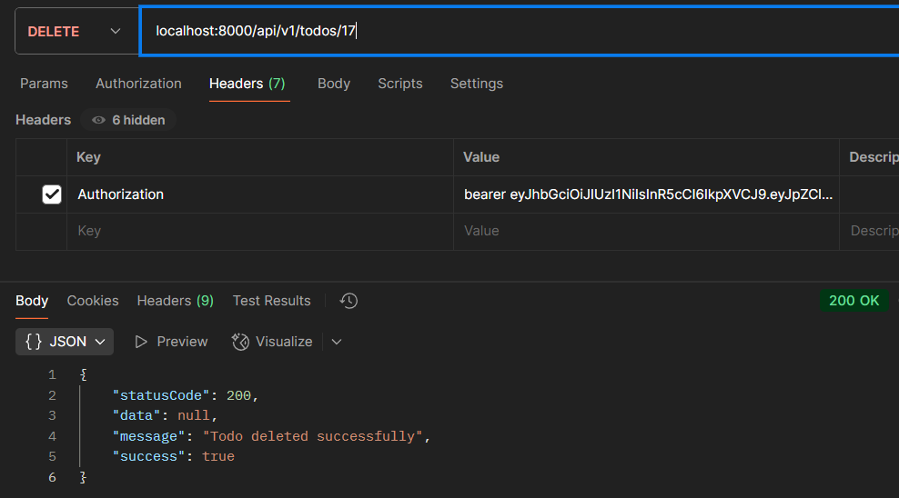

# Task-Todo-BE

This repository contains two backend APIs for a Todo application, built with different technology stacks:

* **ASP.NET Core API** (C# / EF Core / MySQL)
* **Node.js API** (Express / TypeScript / MySQL)

---

## Features

* **User Authentication:** Secure user registration and login with **JWT authentication**.
* **Todo Management:** Full CRUD (Create, Read, Update, Delete) functionality for managing todos.
* **User-Specific Todos:** Each todo is associated with a specific user, ensuring data separation.
* **Secure Endpoints:** All todo-related endpoints are protected with authorization checks.
* **Database Management:**
    * The **ASP.NET** version uses **EF Core migrations** for database management.
    * The **Node.js** version uses **TypeORM** for its Object-Relational Mapping (ORM).

---

## Prerequisites

To run these APIs, you will need the following installed on your machine:

* **MySQL Server** (local or remote)
* **.NET 8 SDK** (for the ASP.NET Core API)
* **Node.js** (v18.17.0 LTS or v20.x LTS) (for the Node.js API)
* **Postman** or any API testing tool (optional but recommended)

---

## Setup Instructions

### ASP.NET Core API Setup

1.  Clone this repository:
    ```bash
    git clone https://github.com/m-ahsanadil/Task-Todo-BE.git
    cd Task-Todo-BE/ASP
    ```

2.  Before proceeding, make sure you have a MySQL server running or use my database named **`todo_asp`** to test.

3.  Configure your **MySQL connection string** in `appsettings.json`:
    ```json
    "ConnectionStrings": {
      "DefaultConnection": "server=localhost;port=3306;database=todo_asp;user=root;password=yourpassword;"
    }
    ```

4.  Install **EF Core tools** if you haven't already:
    ```bash
    dotnet tool install --global dotnet-ef
    ```

5.  Apply the database migrations to create the necessary tables in your `todo_asp` database:
    ```bash
    dotnet ef database update
    ```

6.  Run the application:
    ```bash
    dotnet run
    ```
    The API will be available at `https://localhost:5000`.

### Node.js API Setup

1.  Navigate to the Node.js folder:
    ```bash
    cd ../Node
    ```

2.  Install the project dependencies:
    ```bash
    npm install
    ```

3.  Ensure you have a MySQL database or use my database named **`todo_node`** to test.

4.  Create a `.env` file in the root of the `Node` directory and add your MySQL connection details and a JWT secret:
    ```ini
    DB_HOST=localhost
    DB_PORT=8000
    DB_USER=root
    DB_PASSWORD=yourpassword
    DB_NAME=todo_node
    JWT_SECRET=your_jwt_secret
    ```
    **Note:** If the `.env` file is not configured with port, the server will automatically run on port `8001` instead of the configured port.


5.  Run the backend server. The database schema (tables) will be created automatically. This is handled by TypeORM using the `synchronize: true` option in `ormconfig.ts`.

6.  Start the development server:
    ```bash
    npm run dev
    ```
    The API will be available at `http://localhost:8000`.

---

## API Endpoints

The following endpoints are available in both APIs.

| Method | Endpoint | Description | Auth Required |
| :--- | :--- | :--- | :--- |
| **POST** | `/api/v1/register` | Register a new user | No |
| **POST** | `/api/v1/login` | Log in and get a JWT token | No |
| **GET** | `/api/v1/todos` | Get a list of todos for the authenticated user | Yes |
| **POST** | `/api/v1/todos` | Create a new todo | Yes |
| **PUT** | `/api/v1/todos/{id}` | Update a specific todo by its ID | Yes |
| **DELETE** | `/api/v1/todos/{id}` | Delete a specific todo by its ID | Yes |

### Notes
* All `/todos` endpoints require a JWT token in the `Authorization` header. The header should be formatted as follows: `Authorization: Bearer <token>`.
* Replace `{id}` with the numeric ID of the specific todo you want to interact with.

---

## API Testing Screenshots

Below are the screenshots demonstrating the API functionality using Postman:

### User Authentication

#### User Registration
)

#### User Login


### Todo Management Operations

#### Get All Todos


#### Create New Todo


#### Update Todo


#### Delete Todo


#### Todo Not Found (Error Handling)


---

## License

This project was developed as part of a company-assigned task.
